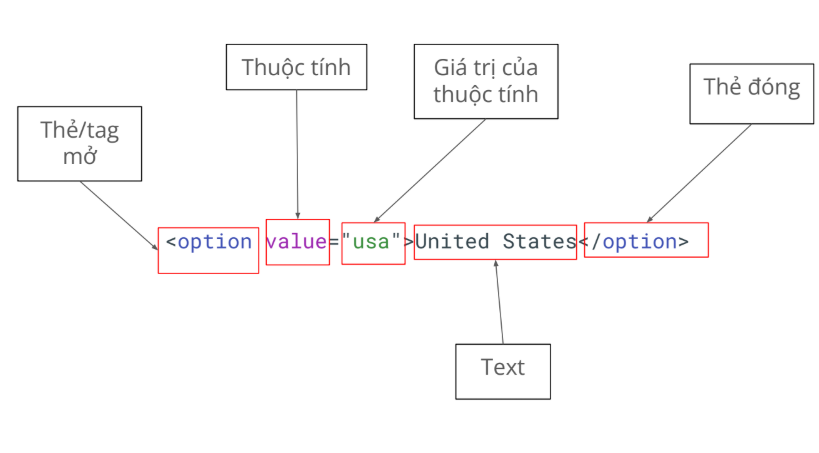

## Tổng hợp kiến thức đã học tại buổi 5

### Function advanced

1. Function expression

    - Function expression là định nghĩa function bằng cách gán nó cho một biến
    
        ```
        eg:
            // Function Declaration (khai báo hàm)
            function add(a, b) {
                return a + b;
            }

            // Function Expression (biểu thức hàm)
            const add = function(a, b) {
                return a + b;
            };
            
            // So sánh cách gọi
            console.log(add(2, 3)); // 5 - cả hai đều giống nhau
        ```

2. Lambda function

    - Lambda function (còn gọi là Arrow Function)

        - Xuất hiện lần đầu trong ES6 (ES2015).

        - Đây là cách viết ngắn gọn hơn cho function

        - Sử dụng dấu `=>`
        
        ```
        eg:
            // Function truyền thống
            function add(a, b) {
                return a + b;
            }

            // Function expression
                const add = function(a, b) {
                return a + b;
            };

            // Arrow function (Lambda)
            const add = (a, b) => {
                ;
            };
        ```

    - Nếu chỉ có 1 dòng code => có thể rút gọn cặp ngoặc nhọn (block code)

        ```
        eg:
            // TH có tham số
            const add = (a, b) => a + b;

            // TH không có tham số
            const greet = () => console.log("Hello!");
            const getRandom = () => Math.random();

            // TH 1 tham số: Có thể bỏ dấu ngoặc tròn
            const double = x => x * 2;
            const square = x => x * x;
            
            // Hoặc giữ dấu ngoặc (tùy style)
            const triple = (x) => x * 3;
        ```

3. Anonymous function

    - Là function không có tên
    - Được sử dụng khi function chỉ cần dùng một lần hoặc được dùng để làm hàm callback

        ```
        eg:
            // Named function (có tên)
            function namedFunction() {
                console.log("I have a name!");
            }

            // Anonymous function (không tên)
            function() { // SyntaxError! Không thể đứng một mình
                console.log("I'm anonymous!");
            }

            // Anonymous function phải được sử dụng ngay
            // 1. Gán cho biến
            const anonymousFunc = function() {
                console.log("I'm anonymous but stored in a variable!");
            };

            // 2. Dùng làm callback
            setTimeout(function() {
                console.log("Anonymous callback!");
            }, 1000);
        ```

### DOM

1. DOM là gì?

    - DOM = Document Object Model: Là cây cấu trúc về các element của 1 website.Mỗi thành phần trong trang web (thẻ \<div\>, \<p\>, \<a\>, text, attribute, …) đều được biểu diễn thành một node (nút) trong cây DOM.

        ```
        eg: 1 element (1 node):
            <option>United States</option>

            trong đó:
            <option>: là thẻ mở
            <\option>: là thẻ đóng
        ```
        
    - Trên thực tế, có rất nhiều loại thẻ khác nhau:

        - Thẻ tiêu chuẩn: thẻ do tổ chức uy tín mozilla định nghĩa

        - Thẻ tự định nghĩa: do lập trình viên/ website tự định nghĩa

    
    - Các thẻ tiêu chuẩn thường gặp:
        
        - Thẻ Cấu Trúc Cơ Bản:

            - `<html>`: Thẻ gốc của trang
            - `<head>`: Chứa metadata: tiêu đề website, hiển thị Google
            - `<body>`: Nội dung của cả website hiển thị
            - `<div>`: Khối/container chung
            - `<span>`: Inline container
            - `<header>`, `<footer>`, `<nav>`, `<section>`: Thẻ ngữ nghĩa

        - Thẻ nội dung:
        
            - `<h1>` đến `<h6>`: Tiêu đề
            - `<p>`: Đoạn văn
            - `<a>`: Liên kếtị
            - ``: Hình ảnh
            - `<span>`: Inline container
            - `<ul>`, `<ol>`, `<li>`: Danh sách

        - Thẻ Form (Quan trọng cho Testing):

            - `<form>`: Biểu mẫu
            - `<input>`: Ô nhập liệu (text, password, checkbox, radio, etc.)
            - `<button>`: Nút bấm
            - `<select>` và `<option>`: Dropdown
            - `<textarea>`: Vùng văn bản nhiều dòng

2. Selector

    - Selector là công cụ để ta tìm được các phần tử và thực hiện Automation. Có 3 loại selector thường dùng:
        
        - XPath:

            - Dùng được trong hầu hết các trường hợp (99.99%)
            - Đa dạng, có khả năng tìm các phần tử khó
            - Hơi dài
                ```
                eg: //button[normalize-space() = ‘Add to cart’]
                ```

        - CSS seletor:

            - Ngắn gọn, performance cao
            - Dùng cho các trường hợp dễ tìm
            - Không linh hoạt bằng XPath
                ```
                eg: .add-to-cart
                ```
        - Playwright selector

            - Chỉ dùng riêng cho Playwright
            - Cú pháp ngắn gọn, không phụ thuộc vào cấu trúc DOM
            - Hướng tới "giống người dùng đang nhìn thấy gì"
                ```
                eg: page.getByText("Add to cart");
                ```
            
    - Nên dùng cái nào? 
        
        `Playwright selector` > `CSS Selector` > `XPath`

        =>:
            
            - Cần học hiểu đủ cả ba loại để làm được mọi dự án
            - Có những dự án dùng CSS, có dự án dùng XPath => buộc học hiểu đủ 3 loại để luôn tuân theo được mọi dự án

    - Các loại khai báo: 

        - Tuyệt đối: Đi dọc theo cây DOM, bắt đầu bởi 1 dấu `/`
        - Tương đối: Tìm dựa vào đặc tính, bắt đầu bởi 2 dấu `//`
            ```
            eg: //tenthe[@thuoctinh=”giatri”]
            ```
        => Nên dùng XPath tương đối

3. Playwright basic syntax (Các cú pháp cơ bản)

    -  `test`: Đơn vị cơ bản để khai báo một test

        ```
        eg:
            import { test } from '@playwright/test';

            test('<tên test>', async ({ page }) => {
                // Code của test
            });
        ```
    
    - `step`: Đơn vị nhỏ hơn test, để khai báo từng step của testcase

        ```
        eg:
            await test.step('Tên step', async () => {
                // Code here
            });

            ---------------------------------------------

            test('<tên test>', async ({ page }) => {
                await test.step('Tên step', async () => {
                    // Code here
                });
            });
        ```
    
         **Lưu ý**: step nên được map 1-1 với test case để dễ dàng maintain.

    - `Navigate`: 

        ```
        eg:
            await
            page.goto('https://pw-practice.playwrightvn.com/');
        ```
    
    - `Locate`:

        ```
        eg:
            page.locator(“//input[@id=’email’]”)
        ```
    
    - `click`:

        ```
        eg:
            Single click
            await page.locator("//button").click();

            Double click
            await page.locator("//button").dblclick();

            Click chuột phải
            page.locator("//button").click({
                button: 'right'
            })

            Click chuột kèm bấm phím khác
            page.locator("").click({
                modifiers: ['Shift'],
            })
        ```
    
    - `input`: 

        ```
        eg:
            Fill
            Giống việc bạn paste content vào một ô input
            page.locator("//input").fill('Playwright Viet Nam');

            pressSequentially
            Giống việc bạn gõ từng chữ cái vào ô input
            page.locator("//input").pressSequentially('Playwright Viet Nam', {
                delay: 100,
            });
        ```

    - `radio/checkbox`:

        ```
        eg:
            Lấy giá trị hiện tại đang là check hay không:
            const isChecked =
            page.locator("//input").isChecked();

            Check/ uncheck
            page.locator("//input").check();
            page.locator("//input").setChecked(false);
        ```

    - `select`: 

        ```
        eg:
            await page.locator('//select[@id=”country”]').selectOption({ label: 'USA' })
        ```
    
    - `upload file`:

        ```
        eg:
            await page.locator("//input[@id='profile']").setInputFiles("<file-path>");
        ```

    - `hover()`: Dùng để thao tác action hover vào element

        ```
        eg:
            await page.locator("<xpath here>").hover();
        ```
    
    - `text()`: Dùng để lấy element theo text có trong element

        ```
        eg:
            element trên DOM:
            <div @class=”playwright”>This is a text</div>

            để chọn phần tử này
            => //div[text()=’This is a text’]
        ```

    - `contains()`: Dùng để lấy element 

        ```
        eg: 
            //div[contains(text(), ‘Tôi là Alex’)]
        ```

    - Cách tương tác với các popup `confirmation dialog`:

        ```
        eg:
            // thực hiện khai báo:
            page.on('dialog', async dialog => dialog.accept());

            // sau đó mới thực hiện thao tác delete
            await page.click(`<XPath element>`);
        ```

    